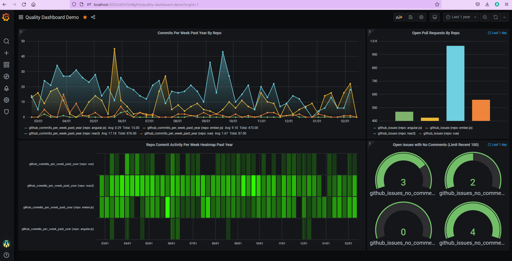

# Quality Dashboard Demo

This repository provides a simple script for pulling data from Github about some popular UI libraries and publishing it to 
a local InfluxDB database. A Grafana Dashboard JSON model template can then be imported to visualize the data.

## Prerequisites
- Docker Desktop
- NodeJS (tested with v12)

## Steps

```
docker run -d --name docker-influxdb-grafana -p 3003:3003 -p 3004:8083 -p 8086:8086 -v influxdb:/var/lib/influxdb -v grafana:/var/lib/grafana philhawthorne/docker-influxdb-grafana:latest
curl -XPOST 'http://localhost:8086/query' --data-urlencode 'q=CREATE DATABASE "test"'
node github.js
```

Manually import the dashboard JSON model (dashboard-demo-json-template.json) at http://localhost:3003/dashboard/import

You should see the following:

